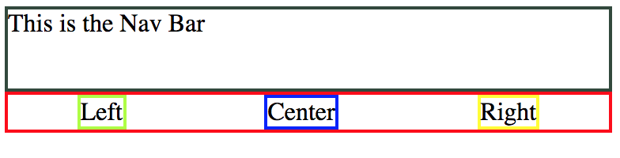
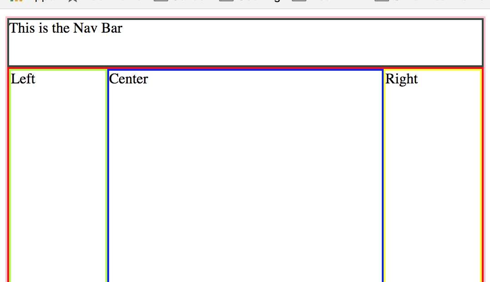
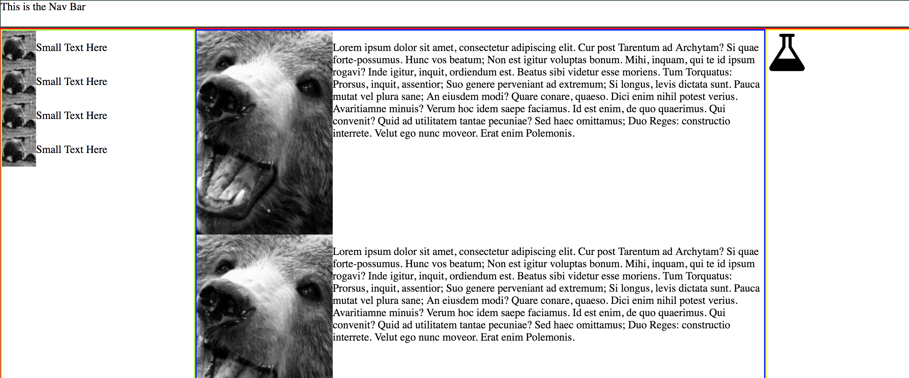
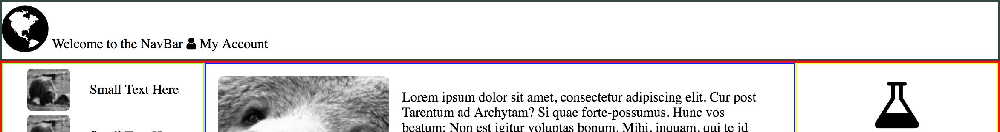
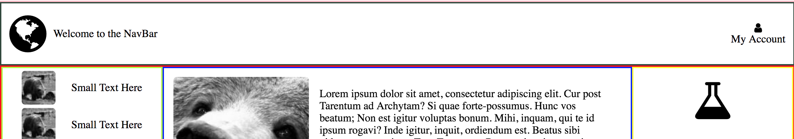
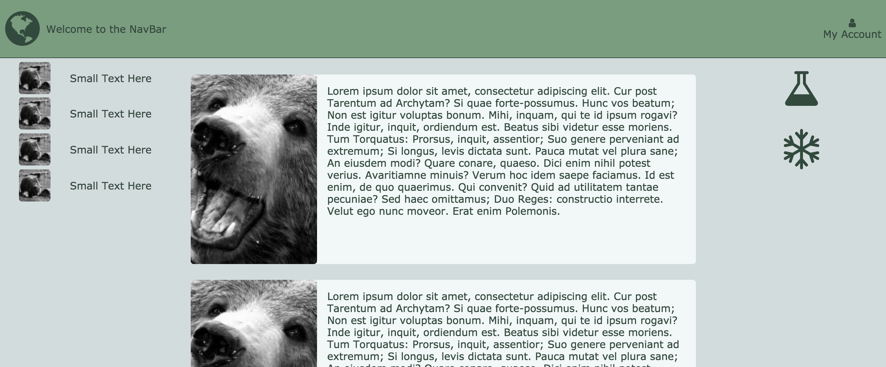

# Layout for Developers

## Objectives

* Use Flexbox to create a static version of a web app
* Incorporate Font Awesome icons in a web app
* Use a palette creation tool to generate a color scheme
* Use placeholder images to create layout without final artwork
* Use placeholder text to mockup layout before content is final
* Use CSS to apply basic styles
* Structure HTML to take advantage of flexbox layout

## Rationale

In waterfall, specifications would be written, work would be given to developers, QA, designers, and others, and teams would wait and be blocked by content.

Agile requires developers to be able to perform all roles. This does not mean that a developer needs to be an artist - they merely need to stub a UI that looks non-horrible.

This lesson teaches developers the basics of layout and using various 3rd party tools to make the process go quickly.

## Instructions

1. Fork this repo
1. Clone this repo
1. Open index.html in your favorite (Chrome) browser
1. Observe the initial layout
1. Follow the steps below to mimic the screenshots one-step at a time
1. Commit along the way
1. Push!

### Step 1: High-Level Structure

The initial decision has been made to start with navbar and body. Next you must decide how to structure your HTML in the body to mimic this 3 column layout:

***Note: It can be helpful to add colorful borders to each main section of your HTML to help visualize them while you edit their layout.***

### Step 2: Use Flexbox to Correct Proportions

* [Guide to Flexbox](https://css-tricks.com/snippets/css/a-guide-to-flexbox/)

### Step 3: Add Mocked Content

Often you will need to mock content.  Fortunately many good resources exist for this purpose.

* [Placehoder images](https://placebear.com/)
* [Placeholder text](https://loripsum.net/)
* [Add Icons](http://fontawesome.io/icons/)

### Step 4:  Add Content to Smaller Components

### Step 5: Use Flexbox to Customize Small Component Layout

### Step 6: Choose Color Palette and Edit Box Model

* [Color Palette Generator](https://coolors.co/)

## Wash, rinse, repeat

A real website will be more complicated: instead of one HTML file you will have many components, the nav bar will have sub-navs, etc.

However, if you follow this "outside-in" approach you can simply repeat the process you have followed above to style an arbitrarily complicated layout.

Take these tools with you, and never be the one using #FF00FF again!

## Stretch

Pick a popular web-app and try to replicate it:

* Facebook
* LinkedIn
* Instagram
* Your favorite app!

Use the techniques you have learned above to style an arbitrarily complicated app!